# Génération d'un certificat SSL wilcard *.docker.localhost

Credit : https://github.com/lstellway/self-signed-ssl

> Ce projet permet la génération d'un certificat auto-signé wilcard *.docker.localhost
> En pratique celui déjà présent dans les sources peut-être utilisé jusqu'en 2034

Génération d'un nouveau certificat et autorité de certification

```bash
make generate-mkcert
```

Les fichiers générés (dans l'ordre):
 * certificat et clef privée de l'autorité de certification local
    * CA.key
    * CA.pem
 * demande de certificat : docker.localhost.csr
 * certificat et clef privée wilcard
    * docker.localhost.crt
    * docker.localhost.key


# Prise en compte du certificat dans votre navigateur

> C'est le certificat de l'autorité de certification locale (CA.pem) qui doit être ajouté à votre navigateur pour valider les requêtes SSL entrantes du domaine *.docker.devhost

L'objectif ici est de permettre à votre navigateur de valider votre certificat autosigné et ainsi d'éviter :

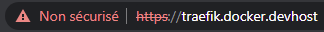

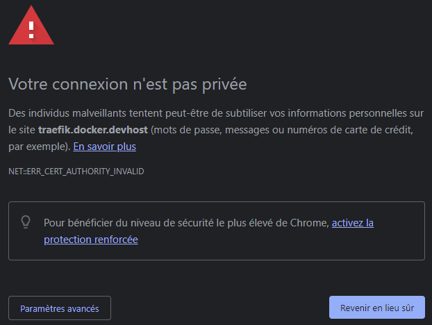

Pour corriger ça il faut ajouter le certificat de l'autorité de certification à l'origine de votre certificat auto-signé.

> Ce certificat d'autorité de certification correspond fichier self-signed-ssl\CA.pem

# Ajout du certificat d'autorité de certification dans chrome

1. Aller dans les paramètres et chercher "certificat"

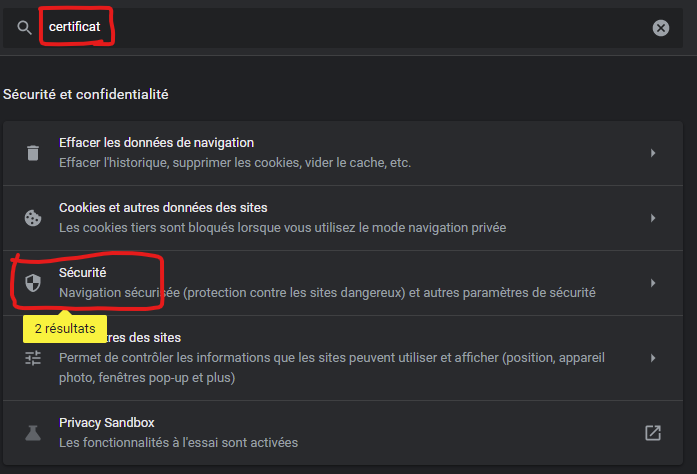

2. Ouvrir "Sécurité" puis "Gérer les certificats"

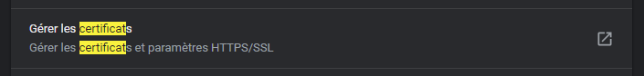

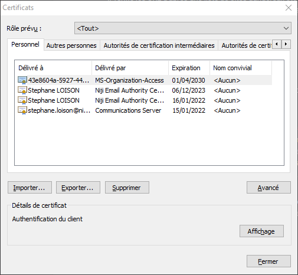

3. Ouvrir l'onlget "Autorités de certification racines de confiance"

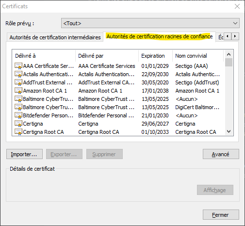

4. Importer... et sélectionner le fichier self-signed-ssl\CA.pem

> Attention, changer le filtre de la boite de dialogue sur * pour voir votre fichier .pem

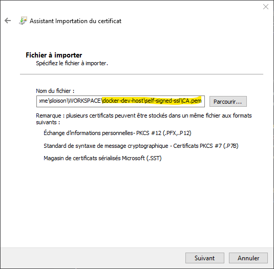

5. Valider l'enregistrement du certificat

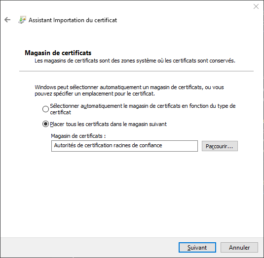

6. Confirmer

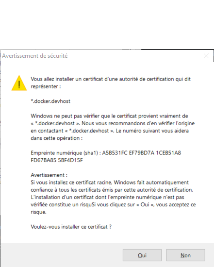

7. Vérifier la présence de votre certificat d'autorité de confiance

> Valide jusqu'en 2034

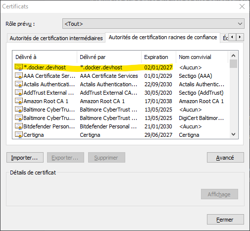

8. Fermer TOUTES les instances de navigateur et relancer

Vérifier que le cadenas est là 
*Ici j'ai une instance traefik déployée dans WSL (voir docker-traefik-portainer)*

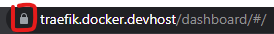